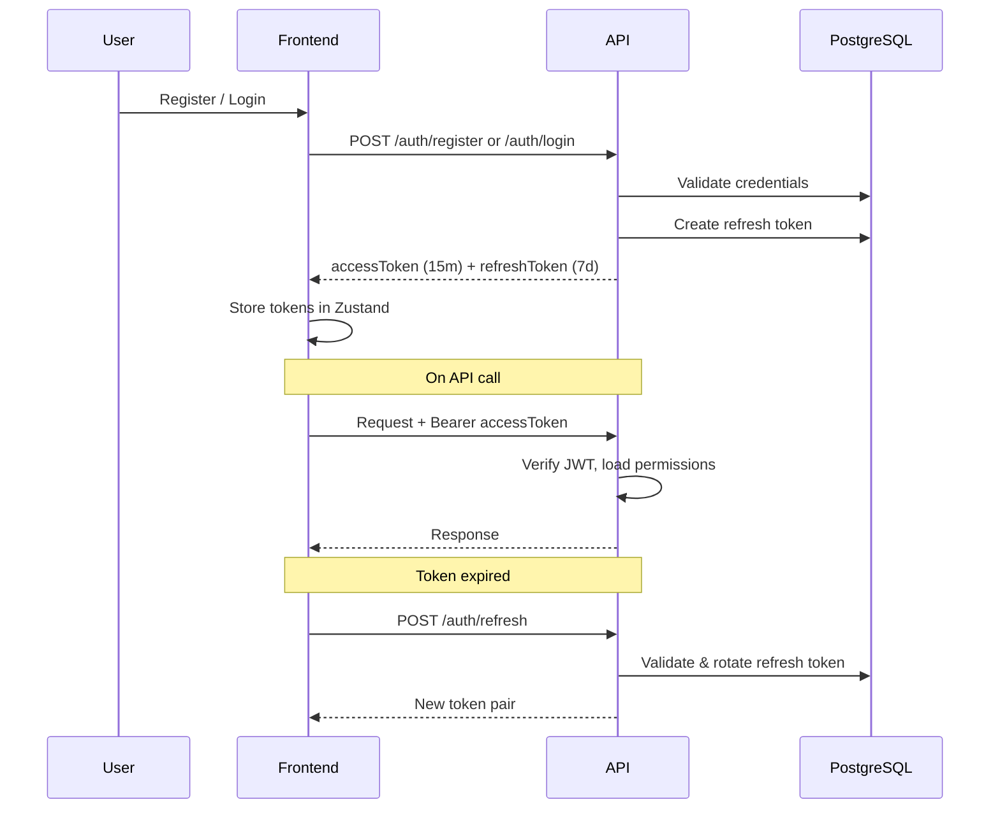
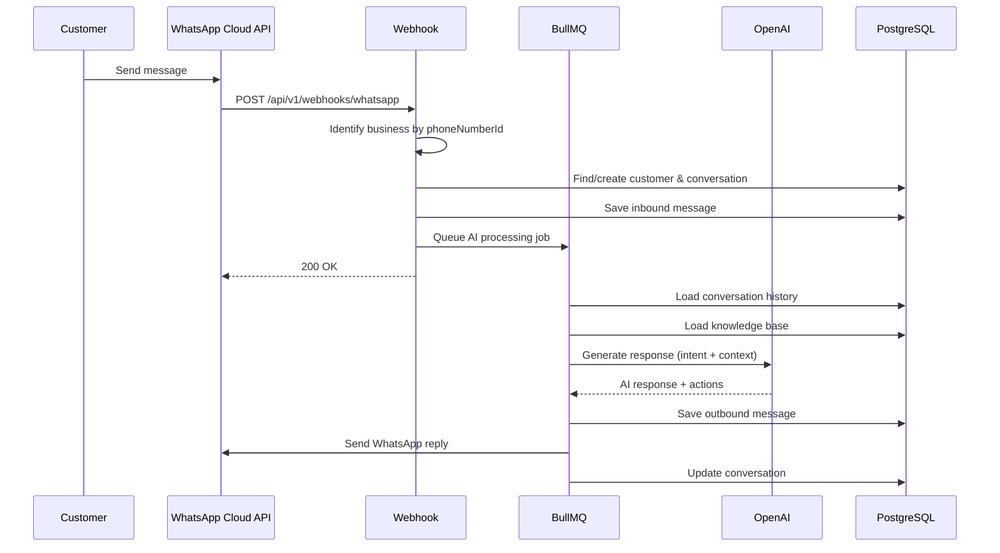
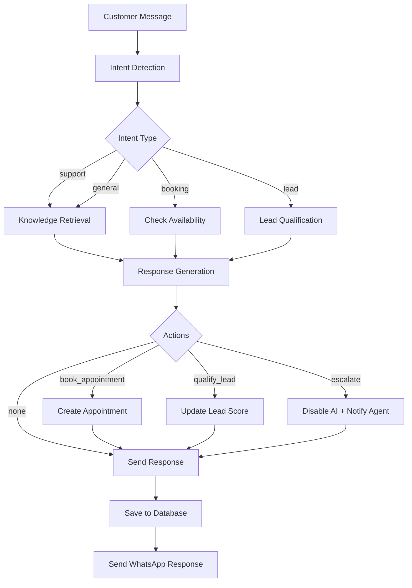
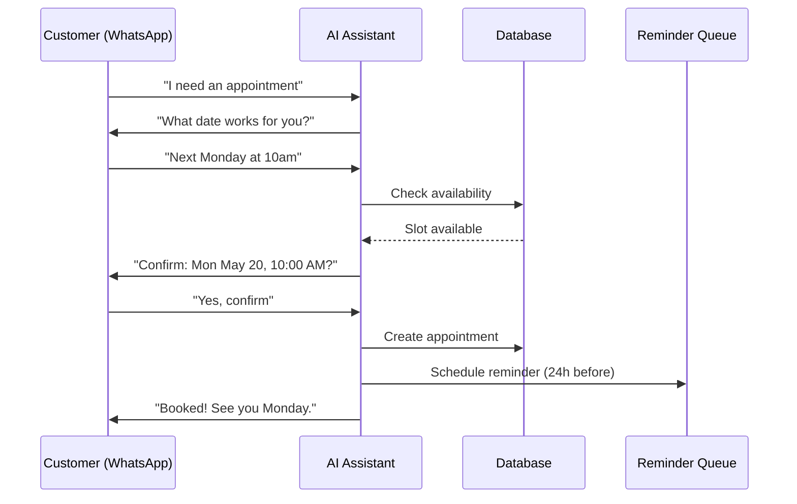
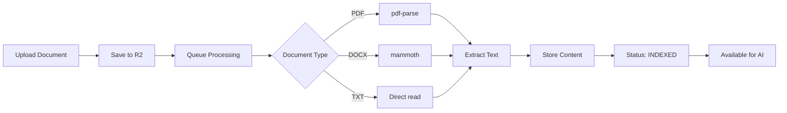

# SmartReception AI — Workflows

## Authentication Flow



### Token Lifecycle

1. **Access Token** — JWT, 15-minute expiry, contains `userId`, `email`, `businessId`, `role`
2. **Refresh Token** — Stored in DB, 7-day expiry, rotated on each refresh
3. **Logout** — Revokes refresh token in DB
4. **Switch Business** — Issues new tokens scoped to selected business

---

## WhatsApp Message Flow



### Webhook Processing Steps

1. **Verify** — Meta sends GET with `hub.verify_token`; respond with `hub.challenge`
2. **Receive** — POST with message payload
3. **Identify Business** — Match `phone_number_id` to `WhatsAppAccount`
4. **Upsert Customer** — Find by phone or create new
5. **Load Conversation** — Find open conversation or create new
6. **Save Message** — Store inbound message with `whatsappMsgId`
7. **Queue AI** — If `isAiEnabled`, enqueue `ai-processing` job
8. **Mark Read** — Send read receipt to WhatsApp

---

## AI Processing Flow



### AI Context Assembly

1. **System Prompt** — From `AIConfiguration.systemPrompt` or default
2. **Knowledge Base** — Top 20 indexed documents/FAQs for the business
3. **Conversation History** — Last 10 messages for context
4. **Business Rules** — Booking enabled, languages, fallback messages

### Response Format

```json
{
  "content": "Your appointment is confirmed for May 20 at 10:00 AM.",
  "intent": "booking",
  "actions": [{ "type": "book_appointment", "data": { "date": "2024-05-20" } }],
  "confidence": 0.92
}
```

---

## Appointment Booking Flow



### Availability Check

- Query existing appointments for the date range
- Check against business hours (from settings)
- Respect service duration for slot calculation
- Prevent double-booking

### Reminder System

- BullMQ delayed job scheduled 24 hours before appointment
- Worker sends WhatsApp reminder message
- Marks `reminderSent = true` on appointment

---

## CRM Workflow

### Customer Lifecycle

1. **Creation** — Auto-created from WhatsApp message or manual entry
2. **Tagging** — Assign tags (VIP, New Lead, etc.)
3. **Notes** — Team members add interaction notes
4. **Lead Scoring** — AI updates score based on qualification intent
5. **History** — All conversations and appointments linked

### Customer Data Model

```
Customer
├── Profile (name, phone, email, whatsappId)
├── Tags (many-to-many via CustomerTagAssignment)
├── Notes (CustomerNote[])
├── Conversations (Conversation[])
└── Appointments (Appointment[])
```

---

## Knowledge Base Workflow



### FAQ Management

- FAQs stored directly as `KnowledgeDocument` with `type: FAQ`
- Question/answer pairs indexed immediately (no processing queue)
- AI retrieves FAQs alongside document content during response generation

---

## Multi-Tenant Data Isolation

Every API request follows this pattern:

```
JWT → businessId → Repository.filter({ businessId }) → Response
```

Cross-tenant access is prevented at three levels:
1. **JWT** — Contains scoped `businessId`
2. **Middleware** — `requireBusiness()` + `tenantScope()`
3. **Repository** — Every query includes `where: { businessId }`
